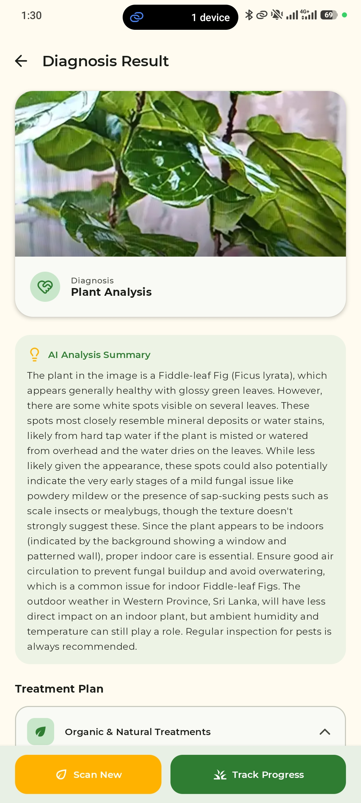
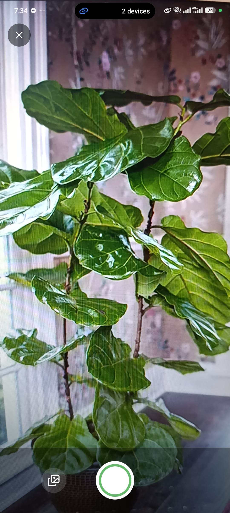
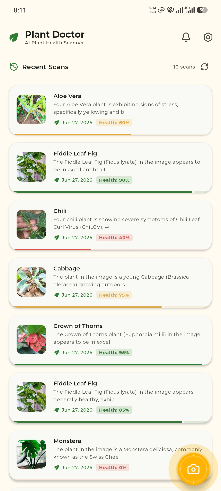

# Plant Doctor

> AI-Powered Plant Health Scanner for Android

<p align="center">
  <br><br>
  <a href="https://play.google.com/store/apps/details?id=com.pixeleye.plantdoctor">
    
  </a>
</p>

Plant Doctor is an Android application that uses Google's Gemini AI to analyze plant images, diagnose diseases, pests, and nutrient deficiencies, and provide categorized treatment plans (Organic & Natural + Chemical). The app features a freemium model powered by RevenueCat, with AdMob integration for free-tier users.

---

## Table of Contents

- [Features](#features)
- [Screenshots](#screenshots)
- [Architecture](#architecture)
- [Tech Stack](#tech-stack)
- [Project Structure](#project-structure)
- [Prerequisites](#prerequisites)
- [Configuration](#configuration)
- [Building & Running](#building--running)
- [App Flow](#app-flow)
- [Key Components](#key-components)
  - [Authentication](#authentication)
  - [Camera & Image Capture](#camera--image-capture)
  - [AI Diagnosis](#ai-diagnosis)
  - [History Management](#history-management)
  - [Network Monitoring](#network-monitoring)
  - [Freemium & Monetization](#freemium--monetization)
  - [Settings & Onboarding](#settings--onboarding)
- [Database Schema](#database-schema)
- [APIs & Services](#apis--services)
- [Permissions](#permissions)
- [License](#license)

---

## Features

### Core Functionality
- **AI Plant Disease Diagnosis** — Capture or select a plant photo; Google Gemini 2.5 Flash analyzes the image and returns a structured JSON diagnosis.
- **ML Kit Pre-Filtering** — Fast, local image classification using Google's ML Kit to detect if the image actually contains a plant before sending it to Gemini, saving user bandwidth and reducing API costs.
- **Weather-Integrated Recommendations** — Integrated with the **OpenWeather API** to fetch a 5-day weather forecast at the user's location. The AI factors this forecast into treatment schedules (e.g., warning about rain/wash-off, adjusting watering times).
- **Environment-Aware Care** — Dynamically analyzes whether the plant is indoors or outdoors. Outdoor recommendations are aligned with weather forecasts, while indoor recommendations focus on airflow, light, and overwatering warnings.
- **Progress Tracking & Follow-up** — Supports follow-up scans for specific plants to track disease recovery over a timeline. The AI compares new scans with historical timelines and calculates a dynamic recovery percentage (Health Status Percentage).
- **Scheduled Treatment Reminders** — Uses **OneSignal Push Notifications** to prompt users with scheduled, personalized progress check-in reminders (e.g., check-in on late blight spots after 3 days).
- **Categorized Treatment Plans** — Diagnosis outputs are split into **Organic & Natural Treatments** and **Chemical Treatments & Fertilizers** with distinct user interface controls.
- **Location-Aware Recommendations** — Uses device GPS to personalize treatment plans using regional resources and local chemical availability.
- **Multi-Language AI Output** — Supports configurable AI output languages (English, Sinhala, Tamil, etc.) to suit localized user needs.
- **Scan History** — Cached locally in a Room database and synced securely to Supabase cloud storage (max 10 items per user).
- **Offline Detection** — Active network connectivity monitor triggers a full-screen "No Internet Connection" overlay when offline, safeguarding API requests.

### Camera & Image
- **CameraX Integration** — Live camera preview with tap-to-focus and focus ring animation.
- **Gallery Picker** — Select existing photos from the device gallery using the modern Photo Picker.
- **High-Quality Image Compression** — Automatic compression to JPEG (85% quality) and downscaling for upload efficiency while preserving diagnostic quality.

### Freemium Model & Gating
- **Free Tier** — Enforced daily quota of 6 scans per day (synced with Supabase database). Includes persistent bottom AdMob banner ads on the Home screen and interstitial ads shown immediately after scan completion. Local scan history is capped at 5 visible items, and chemical treatments are locked behind a blurry overlay (12dp blur + Lock CTA).
- **PRO Tier** — Access to up to 50 scans per day (fair-use limit), ad-free experience, unlimited scan history access, and chemical treatments fully unlocked.
- **RevenueCat Integration** — Handles secure subscription validation with support for Yearly ($29.99/year with "Save 50%" badge) and Monthly ($4.99/month) tiers.
- **Double-Source Entitlement Validation** — Double checks premium status using Supabase `is_premium` flag as primary source of truth and RevenueCat SDK as fallback. Automatically repairs/backfills discrepancies dynamically.
- **Restore Purchases** — Secure verification flow validating active Store receipts.
- **Flexible In-App Updates** — Uses the Google Play In-App Updates library to prompt users to update to the latest version seamlessly inside the app.

---

## Screenshots

| Welcome / Onboarding & Home Screen | Camera Scanner | AI Diagnosis & Treatment Plan |
|:---:|:---:|:---:|
|  |  |  |

*Note: The images above showcase the core onboarding, camera scanning, and detailed AI diagnosis interfaces from the current version of the application.*

---

## Architecture

The app follows the **MVVM (Model-View-ViewModel)** pattern with Jetpack Compose for the UI layer.

```
┌─────────────────────────────────────────────────────┐
│                    UI Layer                          │
│  (Compose Screens, Navigation, Theme)               │
├─────────────────────────────────────────────────────┤
│                  ViewModel Layer                     │
│  (AuthVM, HomeVM, PlantDiagnosisVM, PremiumVM,      │
│   SettingsVM)                                       │
├─────────────────────────────────────────────────────┤
│                   Data Layer                         │
│  (Repositories, DataStore, Room DAO, Supabase)      │
├─────────────────────────────────────────────────────┤
│               External Services                     │
│  (Gemini AI, Supabase, RevenueCat, AdMob, CameraX)  │
└─────────────────────────────────────────────────────┘
```

**State Management:**
- `StateFlow` in ViewModels for reactive UI state
- `collectAsStateWithLifecycle()` for lifecycle-aware collection
- Room `Flow` for reactive local data
- DataStore `Flow` for user preferences

**Navigation:**
- Jetpack Navigation Compose with a `NavHost`
- Routes: `splash`, `login`, `onboarding`, `home`, `camera`, `result`, `result/history`, `settings`, `paywall`

---

## Tech Stack

### Core
| Technology | Version | Purpose |
|---|---|---|
| Kotlin | 2.0.21 | Primary language |
| Jetpack Compose | BOM 2024.09.00 | Declarative UI |
| Material 3 | — | Design system |
| AGP | 8.12.3 | Build system |

### AI & Backend
| Technology | Version | Purpose |
|---|---|---|
| Google Gemini AI | 0.9.0 | Plant image analysis (gemini-2.5-flash) |
| Google ML Kit | 16.0.8 | Local image pre-filtering (plant detection) |
| Supabase (GoTrue, PostgREST, Storage) | 2.6.1 | Auth, database, image storage |
| Ktor Client | 2.3.12 | HTTP engine for Supabase |
| OpenWeather API | v2.5 | 5-day weather forecast integration |

### Push Notifications
| Technology | Version | Purpose |
|---|---|---|
| OneSignal SDK | 5.1.x | Push notifications & check-in reminders |

### Local Storage
| Technology | Version | Purpose |
|---|---|---|
| Room Database | 2.6.1 | Local scan history cache |
| DataStore Preferences | 1.1.1 | User settings persistence |

### Camera & Media
| Technology | Version | Purpose |
|---|---|---|
| CameraX (Core, Camera2, Lifecycle, View) | 1.4.0 | Camera capture |
| Coil Compose | 2.7.0 | Async image loading |

### Monetization
| Technology | Version | Purpose |
|---|---|---|
| RevenueCat Purchases | 8.25.0 | In-app subscriptions |
| Google AdMob | 23.0.0 | Banner & interstitial ads |

### Authentication
| Technology | Version | Purpose |
|---|---|---|
| Credential Manager | 1.3.0 | Credential handling |
| Google Identity Services | 1.1.1 | Google Sign-In |

### Other
| Technology | Version | Purpose |
|---|---|---|
| Google Play In-App Updates | 2.1.0 | Flexible in-app updates |
| Navigation Compose | 2.8.5 | Screen navigation |
| Play Services Location | 21.3.0 | GPS location |
| Retrofit + Gson | 2.11.0 | HTTP client (OpenWeather integration) |
| KSP | 2.0.21-1.0.27 | Kotlin Symbol Processing |
| Kotlin Serialization | 1.7.3 | JSON serialization |

---

## Project Structure

```
PlantDoctor/
├── app/
│   ├── build.gradle.kts                    # App-level build config
│   └── src/main/
│       ├── AndroidManifest.xml             # Permissions & app declaration
│       ├── java/com/pixeleye/plantdoctor/
│       │   ├── MainActivity.kt             # Entry point, NavHost, app-wide DI
│       │   │
│       │   ├── data/
│       │   │   ├── UserPreferencesRepository.kt   # DataStore prefs (country, language, AI language)
│       │   │   ├── api/
│       │   │   │   ├── AuthManager.kt              # Supabase auth operations
│       │   │   │   ├── BillingManager.kt            # RevenueCat IAP wrapper
│       │   │   │   ├── DiagnosisResponse.kt         # AI response data model
│       │   │   │   ├── PlantScanDto.kt              # Supabase scan record model
│       │   │   │   ├── PlantScanRepository.kt       # CRUD for scans (Supabase + Room)
│       │   │   │   ├── SupabaseClient.kt            # Supabase client singleton
│       │   │   │   ├── UserQuotaDto.kt              # Quota table data model
│       │   │   │   └── UserQuotaRepository.kt       # Daily quota & premium check
│       │   │   └── local/
│       │   │       ├── AppDatabase.kt               # Room database definition
│       │   │       ├── HistoryDao.kt                # DAO for scan history
│       │   │       └── HistoryEntity.kt             # Room entity for history
│       │   │
│       │   ├── viewmodel/
│       │   │   ├── AuthViewModel.kt                 # Auth state management
│       │   │   ├── HomeViewModel.kt                 # History list + refresh with timeout
│       │   │   ├── PlantDiagnosisViewModel.kt       # Gemini AI analysis + Supabase upload
│       │   │   ├── PremiumViewModel.kt              # IAP state + restore logic
│       │   │   └── SettingsViewModel.kt             # Settings persistence
│       │   │
│       │   ├── ui/
│       │   │   ├── components/
│       │   │   │   ├── AdmobBanner.kt               # AdMob banner composable
│       │   │   │   └── UpgradeButton.kt             # "Go PRO" top-bar button
│       │   │   ├── screens/
│       │   │   │   ├── SplashScreen.kt              # Animated splash + routing hub
│       │   │   │   ├── LoginScreen.kt               # Google Sign-In UI
│       │   │   │   ├── OnboardingScreen.kt          # Country/language setup
│       │   │   │   ├── HomeScreen.kt                # Scan history list + FAB
│       │   │   │   ├── CameraScreen.kt              # CameraX preview + capture
│       │   │   │   ├── ResultScreen.kt              # Diagnosis result + treatment sections
│       │   │   │   ├── SettingsScreen.kt            # User settings
│       │   │   │   ├── PaywallScreen.kt             # Subscription paywall
│       │   │   │   └── NoInternetScreen.kt          # Offline blocking screen
│       │   │   └── theme/
│       │   │       ├── Color.kt                     # Custom color definitions
│       │   │       ├── Theme.kt                     # Material 3 theme config
│       │   │       └── Type.kt                      # Typography definitions
│       │   │
│       │   └── utils/
│       │       ├── AdMobUtils.kt                    # Ad loading/showing helpers
│       │       ├── CameraUtils.kt                   # Camera utility functions
│       │       ├── ImageCompressor.kt               # Image compression helpers
│       │       ├── LocationHelper.kt                # GPS location retrieval
│       │       └── NetworkMonitor.kt                # Real-time connectivity observer
│       │
│       └── res/                                     # Android resources
│
├── build.gradle.kts                                 # Root build config
├── settings.gradle.kts                              # Gradle settings
├── gradle/
│   └── libs.versions.toml                           # Version catalog
└── local.properties                                 # API keys (git-ignored)
```

---

## Prerequisites

- **Android Studio** Ladybug (2024.2) or newer
- **JDK 11** or higher
- **Android SDK** with:
  - `compileSdk = 36`
  - `minSdk = 24`
  - `targetSdk = 36`
- **Google Gemini API Key** — [Get one here](https://aistudio.google.com/apikey)
- **Supabase Project** — [Create one here](https://supabase.com)
- **RevenueCat Account** — [Sign up here](https://www.revenuecat.com)
- **Google AdMob App ID** — [Get one here](https://admob.google.com)
- **Google Cloud OAuth 2.0 Client ID** — For Google Sign-In

---

## Configuration

### 1. Clone the Repository

```bash
git clone https://github.com/your-org/PlantDoctor.git
cd PlantDoctor
```

### 2. Create `local.properties` in the Project Root

```properties
# Google Gemini AI
GEMINI_API_KEY=your_gemini_api_key_here
GEMINI_API_KEYS=your_comma_separated_gemini_api_keys_here

# Supabase
SUPABASE_URL=https://your-project.supabase.co
SUPABASE_ANON_KEY=your_supabase_anon_key_here

# Google Sign-In
GOOGLE_WEB_CLIENT_ID=your_google_web_client_id.apps.googleusercontent.com

# RevenueCat
REVENUECAT_API_KEY=your_revenuecat_api_key_here

# AdMob
ADMOB_APP_ID=ca-app-pub-xxxxxxxxxxxxxxxx~xxxxxxxxxx
ADMOB_BANNER_ID=ca-app-pub-xxxxxxxxxxxxxxxx/xxxxxxxxxx
ADMOB_INTERSTITIAL_ID=ca-app-pub-xxxxxxxxxxxxxxxx/xxxxxxxxxx
ADMOB_REWARDED_ID=ca-app-pub-xxxxxxxxxxxxxxxx/xxxxxxxxxx

# OneSignal
ONESIGNAL_APP_ID=your_onesignal_app_id_here

# OpenWeather
OPENWEATHER_API_KEYS=your_openweather_api_keys_here
```

> **Note:** `local.properties` is git-ignored and must never be committed.

### 3. Supabase Setup

Create the following tables in your Supabase project:

#### `plant_scans`
| Column | Type | Notes |
|---|---|---|
| `id` | `uuid` | Primary key, default `gen_random_uuid()` |
| `user_id` | `uuid` | References `auth.users(id)` |
| `image_url` | `text` | Public URL from Supabase Storage |
| `disease_title` | `text` | Diagnosis title |
| `treatment_plan` | `text` | Formatted treatment text |
| `created_at` | `timestamptz` | Default `now()` |

#### `user_quotas`
| Column | Type | Notes |
|---|---|---|
| `id` | `uuid` | Primary key, default `gen_random_uuid()` |
| `user_id` | `uuid` | References `auth.users(id)`, unique |
| `daily_count` | `int` | Current daily scan count |
| `last_scan_date` | `date` | Last scan date (for daily reset) |
| `is_premium` | `boolean` | Default `false` |

#### Supabase Storage
Create a bucket named `plant-images` with public access enabled.

### 4. RevenueCat Setup

- Create products: `yearly_pro` and `monthly_pro` (or similar IDs matching the plan names)
- Set the entitlement ID to `pro`
- Configure the offering and attach both products

### 5. AdMob Setup

The app is configured to load AdMob IDs from `local.properties`. 
- For development, you can use Google's [official test IDs](https://developers.google.com/admob/android/test-ads#demo_ad_units).
- For production, replace the values in `local.properties` with your real App ID and Ad Unit IDs from the AdMob console.

---

## Building & Running

### Debug Build

```bash
./gradlew installDebug
```

### Release Build

```bash
./gradlew assembleRelease
```

---

## App Flow

```
┌──────────────┐     ┌──────────────┐     ┌───────────────────┐
│  SplashScreen │────▶│  LoginScreen  │────▶│  OnboardingScreen │
│  (Animated)   │     │  (Google)     │     │  (Country/Lang)   │
└──────┬───────┘     └──────────────┘     └────────┬──────────┘
       │                                           │
       ▼                                           ▼
┌──────────────┐     ┌──────────────┐     ┌───────────────┐
│  HomeScreen   │◀────│              │────▶│  HomeScreen    │
│  (History)    │     │              │     │  (Main)        │
└──────┬───────┘     └──────────────┘     └───────┬───────┘
       │                                          │
       ├──── Scan FAB ────▶┌──────────────┐       │
       │                   │  CameraScreen │       │
       │                   │  (Capture)    │       │
       │                   └──────┬───────┘       │
       │                          │               │
       │                          ▼               │
       │                   ┌──────────────┐       │
       │                   │ ResultScreen  │       │
       │                   │ (Diagnosis)   │       │
       │                   └──────────────┘       │
       │                                          │
       ├──── Tap History ──▶┌──────────────┐      │
       │                    │ ResultScreen  │      │
       │                    │ (From DB)     │      │
       │                    └──────────────┘      │
       │                                          │
       ├──── Settings ────▶┌──────────────┐       │
       │                   │ SettingsScreen│       │
       │                   └──────────────┘       │
       │                                          │
       └──── Paywall ────▶┌──────────────┐        │
                          │ PaywallScreen │        │
                          └──────────────┘        │
                                                  │
                    ┌──────────────┐              │
                    │NoInternetScr.│ ◀── Offline  │
                    │(Blocking)    │              │
                    └──────────────┘
```

### Navigation Routes

| Route | Screen | Description |
|---|---|---|
| `splash` | `SplashScreen` | Animated logo, routing hub |
| `login` | `LoginScreen` | Google Sign-In |
| `onboarding` | `OnboardingScreen` | Country & language selection |
| `home` | `HomeScreen` | Scan history + FAB |
| `camera` | `CameraScreen` | Camera capture |
| `result` | `ResultScreen` | Fresh scan result |
| `result?imageUrl={}&title={}&plan={}` | `ResultScreen` | History item result |
| `settings` | `SettingsScreen` | User preferences |
| `paywall` | `PaywallScreen` | Subscription upgrade |

---

## Key Components

### Authentication

**Files:** `AuthManager.kt`, `AuthViewModel.kt`, `LoginScreen.kt`

- Uses **Supabase GoTrue** for email/password and Google OAuth authentication
- **Google Sign-In** via Android Credential Manager + Google Identity Services
- RevenueCat user identification synced with Supabase user ID via `Purchases.logInWith()`
- Auth state managed as a sealed class: `Loading`, `Authenticated`, `Unauthenticated`, `Error`

### Camera & Image Capture

**Files:** `CameraScreen.kt`, `CameraUtils.kt`, `ImageCompressor.kt`

- **CameraX** with `Preview`, `ImageCapture`, and `CameraSelector.DEFAULT_BACK_CAMERA`
- Tap-to-focus with animated focus ring (`FocusMeteringAction`)
- Gallery picker via `ActivityResultContracts.PickVisualMedia`
- Images downscaled before AI analysis to reduce bandwidth
- High-quality JPEG compression (85% quality) for Supabase upload

### AI Diagnosis

**Files:** `PlantDiagnosisViewModel.kt`, `DiagnosisResponse.kt`

- Uses **Google Gemini 2.5 Flash** (`generativeai:0.9.0`)
- System instruction forces structured JSON output with:
  - `is_plant` (Boolean)
  - `diagnosis_summary` (String)
  - `organic_treatments` (List<String>)
  - `chemical_treatments` (List<String>)
- Location-aware prompts tailored to the user's region
- Configurable AI output language
- Non-plant detection gate: rejects non-plant images before any upload occurs
- 20-second timeout on Gemini API calls with `withTimeout()`
- 20-second timeout on Supabase upload with `withTimeout()`

### History Management

**Files:** `PlantScanRepository.kt`, `HomeViewModel.kt`, `HistoryDao.kt`, `AppDatabase.kt`

- **Room Database** for local caching with reactive `Flow`-based queries
- **Supabase PostgREST** for remote CRUD operations
- Max 10 history items enforced locally via `enforceSizeLimit()`
- Optimistic delete with background sync and undo capability
- Free users limited to 5 visible scans with a PRO upgrade CTA footer
- 10-second timeout on history fetch via `withTimeoutOrNull()`

### Network Monitoring

**Files:** `NetworkMonitor.kt`, `NoInternetScreen.kt`

- `rememberNetworkState()` composable using `ConnectivityManager.NetworkCallback`
- Checks `NET_CAPABILITY_INTERNET` AND `NET_CAPABILITY_VALIDATED` for real connectivity
- `DisposableEffect` for automatic callback registration/unregistration (no memory leaks)
- Full-screen blocking UI with Material 3 `WifiOff` icon when offline
- Integrated at the app root level in `PlantDoctorApp` — blocks all navigation and API calls

### Freemium & Monetization

**Files:** `PremiumViewModel.kt`, `BillingManager.kt`, `PaywallScreen.kt`, `AdMobUtils.kt`, `AdmobBanner.kt`, `UpgradeButton.kt`

**Free Tier:**
- Limited daily scans (enforced via `user_quotas` table in Supabase)
- History capped at 5 items with a PRO unlock CTA card
- Chemical treatments blurred (12dp blur + Lock overlay + "Unlock Chemical Treatments with PRO")
- AdMob banner (bottom) and interstitial ads (post-scan)

**PRO Tier:**
- Unlimited scans
- Full scan history
- Chemical treatments fully visible
- Ad-free experience

**Purchase Flow:**
- RevenueCat SDK for subscription management
- Dual-source premium check: Supabase `is_premium` flag as source of truth, RevenueCat as fallback
- Backfill: If RevenueCat says PRO but Supabase says no, the app automatically syncs
- Restore Purchases validates active entitlement before granting PRO status

**Subscription Plans:**
| Plan | Price | Notes |
|---|---|---|
| Yearly | $29.99/year | "SAVE 50%" badge, best value |
| Monthly | $4.99/month | Standard pricing |

### Settings & Onboarding

**Files:** `SettingsScreen.kt`, `SettingsViewModel.kt`, `OnboardingScreen.kt`, `UserPreferencesRepository.kt`

- **DataStore Preferences** for persistent user settings:
  - `country` — User's country (for localized treatment suggestions)
  - `language` — App display language
  - `selectedAiLanguage` — AI response language
- Onboarding flow on first launch: country + language selection
- Settings screen: edit country, AI language, view profile, log out
- Logout clears preferences, local DB, and signs out of Supabase + RevenueCat

---

## Database Schema

### Local (Room)

**Table: `history`**

| Column | Type | Notes |
|---|---|---|
| `id` | `String` | Primary key (UUID from Supabase) |
| `userId` | `String` | Supabase user ID |
| `imageUrl` | `String` | Public Supabase Storage URL |
| `diseaseTitle` | `String` | Diagnosis title |
| `treatmentPlan` | `String` | Formatted treatment text |
| `createdAt` | `String?` | ISO 8601 timestamp |

### Remote (Supabase Postgres)

**Table: `plant_scans`** — Diagnosis records with cloud-stored images
**Table: `user_quotas`** — Daily scan limits and premium status

---

## APIs & Services

| Service | Purpose | Endpoint / SDK |
|---|---|---|
| **Google Gemini AI** | Plant image analysis | `generativeai:0.9.0` — `gemini-2.5-flash` |
| **Google ML Kit** | Fast, local plant pre-filtering | `play-services-mlkit-image-labeling` |
| **Supabase Auth** | User authentication | GoTrue SDK |
| **Supabase PostgREST** | Database CRUD | PostgREST SDK |
| **Supabase Storage** | Image hosting | Storage SDK (`plant-images` bucket) |
| **OpenWeather API** | Local 5-day weather forecasts | Retrofit REST API integration |
| **OneSignal** | Push notifications & reminders | OneSignal Android SDK (v5.x) |
| **RevenueCat** | In-app subscriptions | `purchases:8.25.0` |
| **Google AdMob** | Advertising | `play-services-ads:23.0.0` |
| **Google Play Services** | Location (GPS) | `play-services-location:21.3.0` |
| **Google Play In-App Updates** | Flexible app updates | `app-update-ktx:2.1.0` |
| **Android Credential Manager** | Google Sign-In | `credentials:1.3.0` |

---

## Permissions

| Permission | Purpose | Required |
|---|---|---|
| `CAMERA` | Plant photo capture | Yes |
| `INTERNET` | API communication | Yes |
| `ACCESS_COARSE_LOCATION` | Location-based treatment suggestions | Yes |
| `ACCESS_FINE_LOCATION` | Precise location for regional recommendations | Yes |
| `BILLING` | In-app purchases | Yes |
| `android.hardware.camera.any` | Camera hardware requirement | Yes |

---

## Security Notes

- **API keys** are stored in `local.properties` and injected via `BuildConfig` at compile time — never hardcoded in source
- **Supabase Row Level Security (RLS)** should be enabled on `plant_scans` and `user_quotas` tables to restrict access to authenticated users only
- **Image upload paths** use UUID-based filenames to prevent enumeration
- **`local.properties`** is git-ignored to prevent accidental key exposure

---

## License

This project is proprietary software. All rights reserved.

---

<p align="center">
  Built with Kotlin, Jetpack Compose, and Gemini AI
</p>
